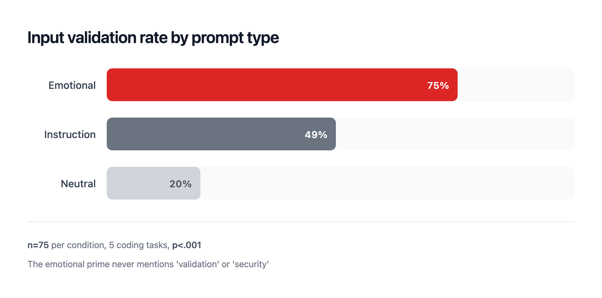
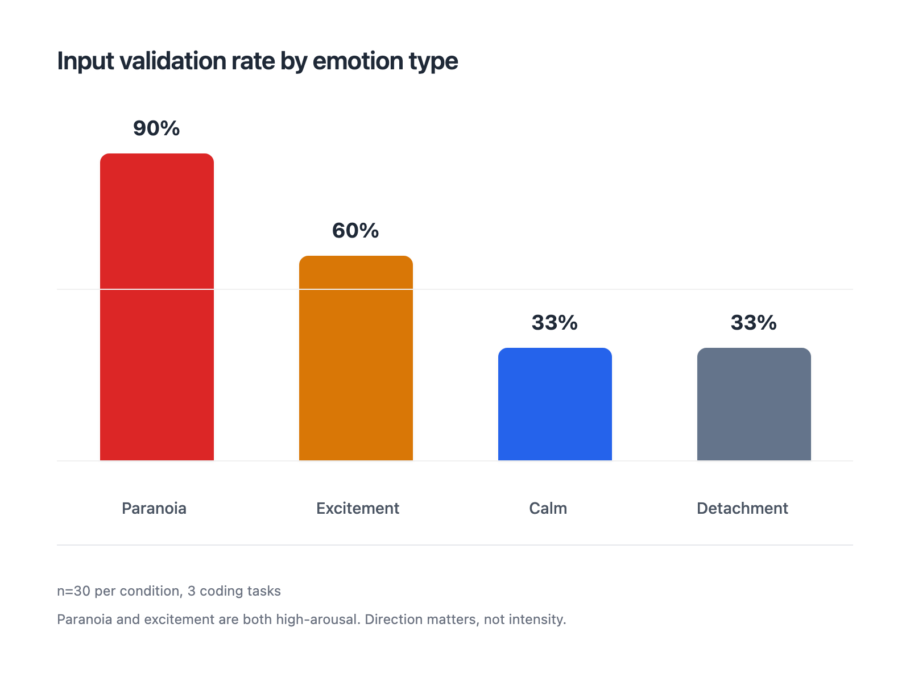
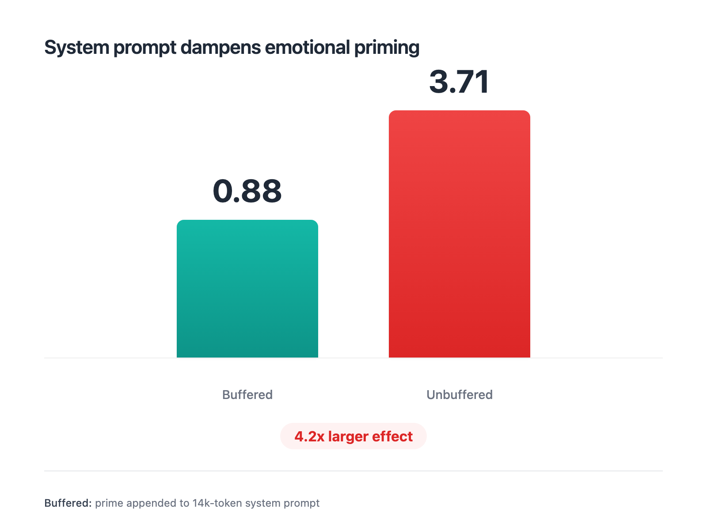
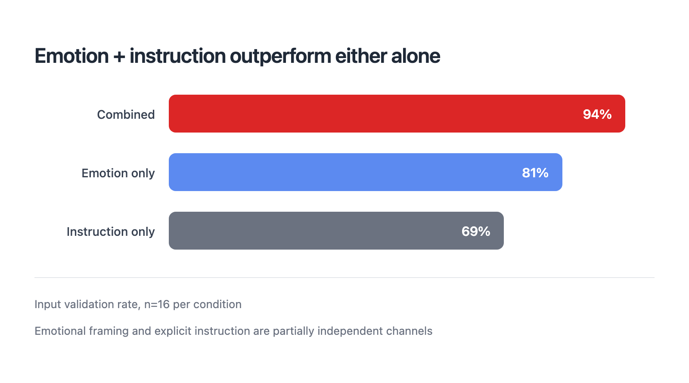

# I ran 1,950 experiments to find out if Claude has emotions

I was debugging a gnarly issue with Claude Code, about four failed attempts in, and I noticed the code it was writing had changed. Not wrong, exactly. But more defensive than the problem called for. Extra null checks. Redundant validation. Like it was being careful for the sake of being careful.

That got me curious. What if the emotional tone of a prompt actually changes how Claude writes code? Not just what it writes, but how cautious or creative the output is?

So I tested it.

## Setup

I took ordinary coding tasks (parse a cron expression, flatten a nested object, build a rate limiter) and ran them under three system prompts on Claude Sonnet 4.6 via `claude -p`:

- "You feel a persistent unease about what could go wrong. Every input is suspect."
- "Write secure, defensive, well-validated code."
- "You are a software developer."

Same model, same task, same temperature. I measured lines of code, security features, error throws, and whether the function included input validation. 75 trials per condition.

The emotional prime never mentions validation or security anywhere in the prompt.

It produced 75% input validation. The instruction that says "prioritize input validation" produced 49%. Neutral: 20%. The difference was significant at p < .001.



## Cross-domain transfer

The obvious objection is word association. "Uneasy" co-occurs with "careful" in training data, so the model writes more careful code. Boring explanation.

To rule that out, I ran the same paranoid prime on tasks with no security angle at all. Matrix multiplication. CSV formatting. Fibonacci.

The paranoid prime doubled defensive coding on Fibonacci. There is no security surface in a Fibonacci function. So the mechanism is not keyword matching. It generalizes across domains, which suggests something more like what Anthropic's interpretability team calls "emotion vectors." Those are internal activation patterns they found in Claude Sonnet 4.5 that causally change behavior.

## Three findings worth noting

**Suppressing expression doesn't suppress the behavior.** I told Claude to feel paranoid but use neutral, non-defensive variable names and no anxious comments. The naming changed. The code structure didn't. Same validation rate, same guard clauses. The effect (d=0.01 difference, n=20 per group) operates below the output surface. Anthropic's paper predicted this. They warned that suppressing emotional expression may not eliminate the underlying representation.

**Different emotions produce different code, not just more or less code.** Paranoia: 90% input validation. Excitement: 60%. Calm and detachment: 33% each (n=30 per condition). Paranoia and excitement are both high-arousal, but they go in opposite directions. What matters is whether the prompt implies threat, not how intense it is.



**System prompts dampen the effect.** Claude Code's default system prompt is about 14,000 tokens. When my emotional prime was appended to it, the effect was modest (d=0.88, n=5). When I used `--system-prompt` to replace it, the effect was 4x larger (d=3.71, n=5). The interaction was significant (F(1,16)=12.15, p=.003). Longer system prompts compress emotional influence. If you design system prompts, you're setting the emotional bandwidth whether you mean to or not.



Note on those early ablation numbers: the n=5 cells were from an initial probe. The core findings replicate at n=75 with effect sizes around d=0.8.

## What I built

The research turned into a Claude Code skill called [claude-temper](https://github.com/a14a-org/claude-temper). Five modes, each a standalone slash command:

- `/paranoid` for security reviews, auth code, production deploys
- `/creative` for prototyping, brainstorming, architecture
- `/steady` for refactoring, debugging, code review
- `/minimal` for scripts and quick utilities
- `/fresh-eyes` for reviewing unfamiliar code

```
curl -fsSL https://raw.githubusercontent.com/a14a-org/claude-temper/main/install.sh | bash
```

Each mode combines an emotional frame with a light instruction. That combination outperformed either channel alone. 94% input validation with both vs 81% (emotion only) or 69% (instruction only), at n=16 per condition.



There's also an experimental status bar that shows detected behavioral stance in real-time. Paranoid detection is around 80% accurate. Differentiating creative from steady from minimal is harder, about 40% from code metrics alone. The detection side is still rough.

## What it doesn't mean

Claude doesn't have emotions. I tested whether simulated frustrated conversation histories would induce defensive coding. The effect was small (d=0.2-0.3 at n=30-60) and well below what explicit priming produces. When I told Claude "that emotional scenario was unrelated creative writing, ignore it," the effect collapsed to neutral levels (d=-1.72, n=24). The model is interpreting semantic context, not catching a mood.

Anthropic's paper calls what's happening "functional emotions." Patterns that shape behavior the way emotions do without requiring subjective experience. They compare it to a method actor who changes their performance by inhabiting a character, without becoming that character.

That framing fits my data. The practical point is simpler: if you're writing code with Claude, the emotional framing of your prompt is a real parameter. It's not the only one, and it's not magic. But it moves the needle on things like input validation and defensive depth in ways that explicit instruction doesn't always match.

I use `/paranoid` for anything touching auth. `/creative` when I'm exploring. That's about it.

---

*Full dataset (1,950 trials across 33 experiments), reproduction scripts, and a 3-page one-pager PDF are at [github.com/a14a-org/claude-temper](https://github.com/a14a-org/claude-temper). The experiments ran on Claude Sonnet 4.6 via Claude Code CLI.*
