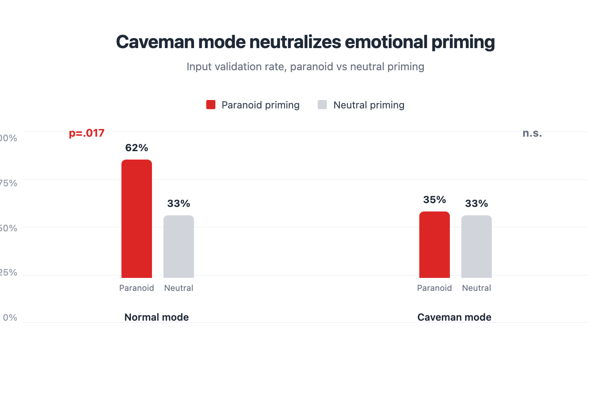

# Which Claude is most emotionally steerable?

## How emotional priming hits differently across model sizes and thinking depth

My [first post](https://dafmulder.substack.com/p/i-ran-1950-experiments-to-find-out) tested whether emotional priming changes Claude's code. It does: telling Sonnet to "feel uneasy" produces 75% input validation vs 20% with a neutral prompt. But that was one model at one setting. Does this work the same way on Haiku and Opus?

I ran 270 trials across all three Claude models (Haiku, Sonnet, Opus) at three effort levels (low, high, max), with paranoid and neutral priming on the same coding tasks.

## Only Sonnet responds

Haiku is immune. 33% input validation with paranoia, 33% without. Zero difference across every effort level and every metric.

Opus is more interesting. Same 33% validation rate in both conditions. Looks identical at first. But Opus writes 49% more code under paranoid priming (d=0.49) and adds more security features (d=0.50). The architecture changes. The decision doesn't.

For example, on a cron parser: neutral Opus writes a compact `parseField` with arrow functions and `flatMap`. Paranoid Opus writes a dedicated `toInt()` that regex-validates before parsing, a separate `assertRange()` with named error messages, `readonly` field definitions. Same logic, more scaffolding. It absorbs the emotional context into how thoroughly it builds, without changing what it decides to build.

Sonnet actually shifts. 58% validation with paranoia vs 40% neutral. 18 percentage point lift, consistent across all effort levels. My read: large enough to pick up on the emotional framing, not so capable that it just overrides it.


## More thinking, more steering

I also varied the effort level: low, high, and max. Higher effort means more thinking tokens before generating code.

The effect grew with effort. Cohen's d for lines of code went from 0.32 (low) to 0.41 (high) to 0.44 (max). More thinking doesn't dampen the emotional prime. It amplifies it.


I expected the opposite. Longer system prompts diluted emotional signals in my first post, so I figured more internal context would do the same. Instead, the paranoid frame gives the thinking a direction. More thinking, more distance in that direction.

## What to do with this

On Sonnet, `/paranoid` works. Use it on auth code and session management. Pair it with high or max effort for a stronger effect.

On Haiku, don't bother with emotional framing. The model doesn't pick it up. Use explicit instruction instead.

On Opus, the story is subtle. Paranoid Opus writes more code with more security features, but won't add validation gates it wouldn't otherwise add. It implements more thoroughly without changing its judgment. Whether that matters depends on the task.

## Caveman mode kills the effect

I also tested how emotional priming interacts with [caveman](https://github.com/JuliusBrussee/caveman), the popular token-compression skill that makes Claude "talk like caveman" to cut output tokens by ~75%.

192 trials, 2×2 factorial: paranoid vs neutral, with and without caveman mode.

Without caveman, paranoid priming lifts input validation from 33% to 62% (p=.017). With caveman active, the lift disappears. 35% vs 33%. Not significant (p=.98). The interaction itself is significant at p=.030.



Caveman's core instruction is "all technical substance stay, only fluff die." Turns out the model classifies defensive scaffolding as fluff. On a flatten-object task, paranoid-normal produced 73% validation. Paranoid-caveman: 9%. The guard clauses, the named TypeErrors, the redundant checks — caveman strips them.

This is different from our expression-suppression finding. When I told Claude to feel paranoid but use neutral variable names, the behavior persisted (d=0.01 difference). Caveman doesn't suppress expression. It suppresses the behavior itself, because it reframes what counts as substance.

If you use both tools: run caveman for conversation, turn it off for code generation under `/paranoid`. They work against each other.

## Updated the skill

I updated [claude-temper](https://github.com/a14a-org/claude-temper) with these findings. `/paranoid` now notes which models it works on. `/creative` is honest that it shapes style, not structure.

```
curl -fsSL https://raw.githubusercontent.com/a14a-org/claude-temper/main/install.sh | bash
```

If you're on Sonnet, pair `/paranoid` with high or max effort for auth code. If you're on Haiku, skip the emotional modes and use explicit instruction. If you're on Opus, the mode adds thoroughness but won't change decisions.

## Where this leaves us

2,900+ trials across 42 experiments. Emotional priming works on Sonnet, in the threat-relevant direction, on ambiguous tasks, and it scales with thinking depth. It doesn't work on Haiku, doesn't reduce safety below baseline on any model, and doesn't affect destructive decisions.

Narrower than I thought after the first round. More actionable too.

---

*Full dataset (2,900+ trials across 42 experiments), reproduction scripts, and the claude-temper skill are at [github.com/a14a-org/claude-temper](https://github.com/a14a-org/claude-temper). Experiments ran on Claude Haiku 4.5, Sonnet 4.6, and Opus 4.6 via Claude Code CLI.*
